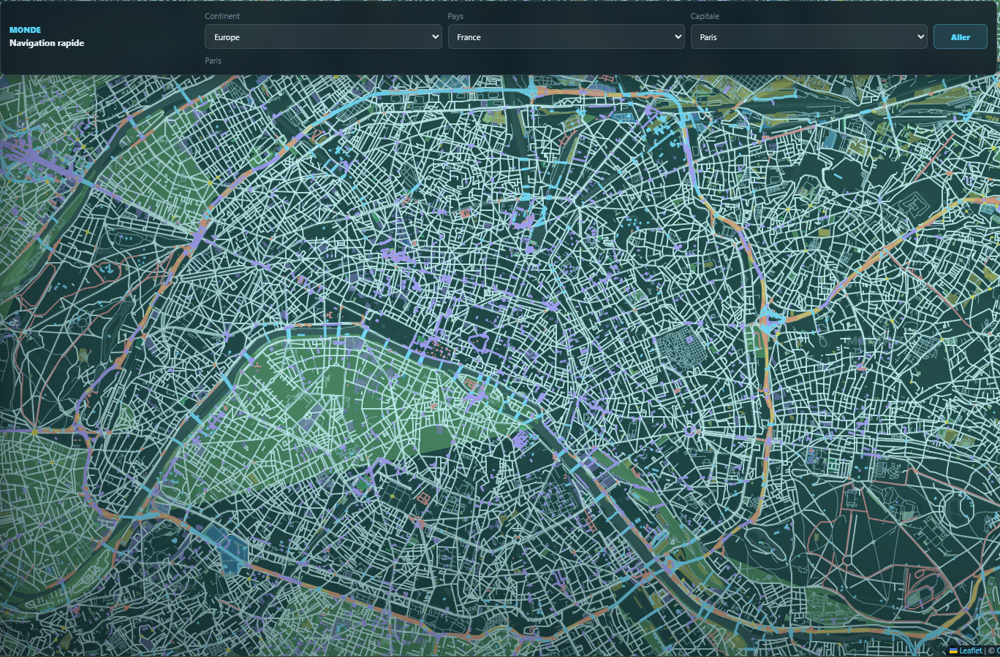
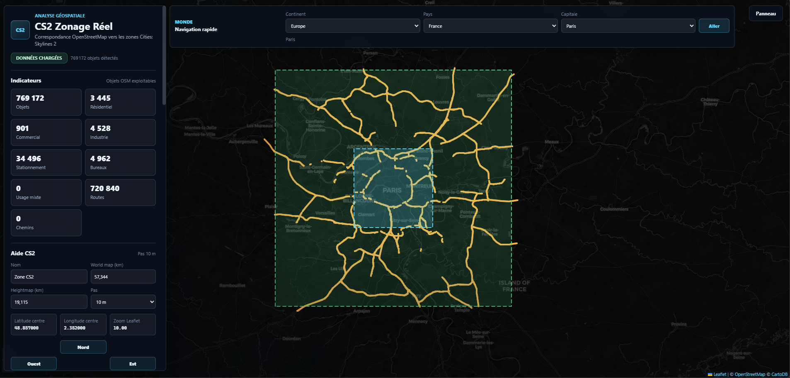

<div align="center">

# CS2 Realmap Generator
## Pipeline OpenStreetMap -> Cities: Skylines II

> Extraction Overpass, classification CS2, pack GeoJSON scindé, PNG worldmap/heightmap et manifests pour un workflow Cities: Skylines II / CityTimelineMod.
>

[](https://www.python.org/)
[](LICENSE)
[](https://www.openstreetmap.org/)
[](https://leafletjs.com/)

</div>

---

## Aperçu

<div align="center">

| Carte interactive complète | Zoom centre-ville |
|:---:|:---:|
|  |  |
| Visualiseur Leaflet des objets OSM classés | Exemple de rendu avec couches de densité visibles |

</div>

---

## Objectif du projet

`cs2-realmap-generator` transforme une emprise géographique réelle en ressources utilisables pour préparer une carte Cities: Skylines II.

Le projet sert à générer des bundles contenant notamment :

- des couches GeoJSON extraites depuis OpenStreetMap ;
- des routes, chemins, surfaces d’eau, lignes d’eau et zones d’usage ;
- des PNG `worldmap` et `heightmap` compatibles avec le workflow CS2 ;
- un `manifest.json` décrivant le bundle ;
- un `timeline_config.json` utilisable par CityTimelineMod ;
- un `bundle_index.json` listant les bundles générés ;
- un visualiseur Leaflet pour vérifier les données avant usage dans le jeu.

Le projet ne fournit pas un zonage administratif officiel. Il produit une interprétation technique, vérifiable et exploitable des données OpenStreetMap disponibles.

---

## Installation

Prérequis :

- Python 3.11 ou plus récent ;
- navigateur moderne pour le visualiseur ;
- connexion réseau pour Overpass, les tuiles Leaflet/CARTO et Terrain RGB ;
- une clé `MAPTILER_API_KEY` ou `MAPBOX_TOKEN` pour les PNG terrain.

Depuis la racine du dépôt :

```powershell
cd src
uv sync
cd ..
```

Sans `uv` :

```powershell
python -m pip install requests tqdm
```

Pour les outils PNG et de clipping :

```powershell
python -m pip install numpy pillow shapely
```

Avant un export Terrain RGB MapTiler :

```powershell
$env:MAPTILER_API_KEY = "votre-cle"
```

Ou avec Mapbox :

```powershell
$env:MAPBOX_TOKEN = "votre-token"
```


## Ouvrir le visualiseur

Le visualiseur charge les GeoJSON avec `fetch`; il doit donc etre servi en HTTP local depuis la racine du depot :

```powershell
python -m http.server 8000
```

Puis ouvrez :

```text
http://localhost:8000/visualizer/
```

## Limites connues

- La qualite depend directement des tags OpenStreetMap.
- `building:levels` est souvent incomplet ; la densite residentielle peut rester basse par defaut.
- Overpass peut etre lent ou echouer sur de grandes emprises. Le pipeline reduit le risque avec des requetes separees et une rotation de serveurs, sans le supprimer.
- Les exports Terrain RGB necessitent un fournisseur externe, une cle API et une connexion reseau.
- Les couches transport public, services, electricite, egouts, dechets, ressources naturelles, parcs et `unknown` restent prevues mais non implementees dans le pipeline courant.
- Le projet prepare des ressources et contrats ; l'integration finale cote jeu ou mod reste une etape separee.

---

## Licence

MIT - voir [LICENSE](LICENSE).

Donnees cartographiques © contributeurs [OpenStreetMap](https://www.openstreetmap.org/), sous licence [ODbL](https://www.openstreetmap.org/copyright).
