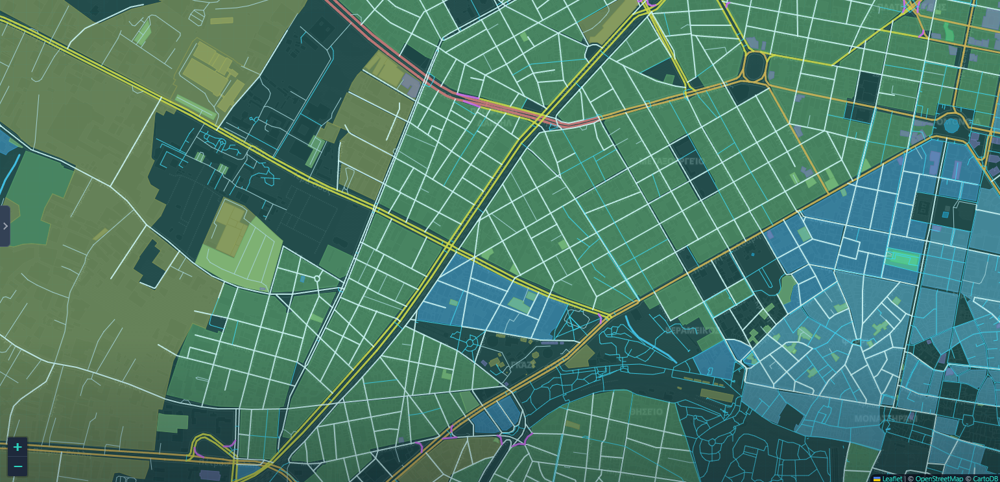
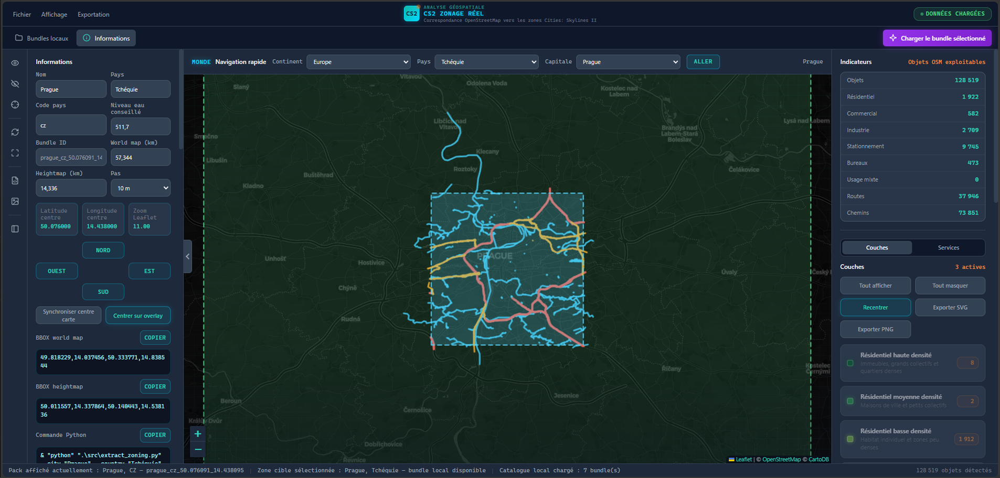

<div align="center">

# CS2 Realmap Generator
## Pipeline OpenStreetMap -> Cities: Skylines II

> Extraction Overpass, classification CS2, pack GeoJSON scindé, PNG worldmap/heightmap et manifests pour un workflow Cities: Skylines II / CityTimelineMod.
>

[](https://www.python.org/)
[](LICENSE)
[](https://www.openstreetmap.org/)
[](https://leafletjs.com/)

</div>

---

## Aperçu

<div align="center">

| Carte interactive complète | Zoom centre-ville |
|:---:|:---:|
|  |  |
| Visualiseur Leaflet des objets OSM classés | Exemple de rendu avec couches de densité visibles |

</div>

---

## Objectif du projet

`cs2-realmap-generator` transforme une emprise géographique réelle en ressources utilisables pour préparer une carte Cities: Skylines II.

Le projet sert à générer des bundles contenant notamment :

- des couches GeoJSON extraites depuis OpenStreetMap ;
- des routes, chemins, surfaces d’eau, lignes d’eau et zones d’usage ;
- un calque ferroviaire autonome dans `geojson/railways.geojson` ;
- des couches de services en points (9 familles : éducation, incendie, médical, parcs, électricité, déchets, transport, eau, communications) ;
- des PNG `worldmap` et `heightmap` compatibles avec le workflow CS2 ;
- un `manifest.json` décrivant le bundle ;
- un `timeline_config.json` utilisable par CityTimelineMod ;
- un `bundle_index.json` listant les bundles générés ;
- un visualiseur Leaflet pour vérifier les données avant usage dans le jeu.

Le projet ne fournit pas un zonage administratif officiel. Il produit une interprétation technique, vérifiable et exploitable des données OpenStreetMap disponibles.

### Contrat du bundle complet

Un pack généré contient 31 sources GeoJSON validées : 7 couches de zonage,
leurs agrégats, les routes et leurs 6 classes, les chemins, l'eau linéaire et
surfacique, le ferroviaire autonome, puis les 9 familles de services. Les
fichiers `layer_index.json`, `roads_index.json` et `services_index.json`
référencent chaque source et leurs comptes sont contrôlés contre le nombre réel
de features. Une couche légitimement vide reste présente avec un compte à zéro.

`all_features.geojson` conserve son nom historique, mais son périmètre est
explicitement `legacy-base-overlays` : il exclut `railways.geojson` et les
services afin de ne jamais dupliquer leurs géométries. Le total intégral et le
nombre d'objets OSM uniques sont publiés dans `extraction_report.json`.

Toutes les données sont exclusivement visuelles et informatives. Aucun fichier
du générateur ne contient d'instruction d'import, de prefab, de spawner ou de
modification d'un réseau du jeu.

### Calque ferroviaire V1

`exports/bundles/<bundle_id>/geojson_pack/geojson/railways.geojson` est l’unique source des voies `rail`, `narrow_gauge`, `tram`, `light_rail` et `subway` actives. Les voies de service `yard`, `siding`, `spur` et `crossover` restent dans ce même fichier ; `light_rail` conserve une catégorie distincte du tramway. Ce GeoJSON fournit exclusivement un plan visuel projeté sur le terrain : aucun import, prefab, spawner ou changement du réseau du jeu n’est généré.

---

## Installation

Prérequis :

- Python 3.11 ou plus récent ;
- navigateur moderne pour le visualiseur ;
- connexion réseau pour Overpass, les tuiles Leaflet/CARTO et Terrain RGB ;
- une clé `MAPTILER_API_KEY` ou `MAPBOX_TOKEN` pour les PNG terrain.

Depuis la racine du dépôt :

```powershell
cd src
uv sync
cd ..
```

Sans `uv`, l'extraction GeoJSON utilise uniquement la bibliothèque standard de
Python et ne nécessite aucun paquet supplémentaire.

Pour les outils PNG et de clipping :

```powershell
python -m pip install numpy pillow shapely
```

Avant un export Terrain RGB MapTiler :

```powershell
$env:MAPTILER_API_KEY = "votre-cle"
```

Ou avec Mapbox :

```powershell
$env:MAPBOX_TOKEN = "votre-token"
```

## Une commande pour le bundle complet

`tools/build_complete_bundle.py` remplace la suite de commandes PowerShell
manuelles. Il exécute, dans cet ordre : extraction GeoJSON scindée, export des
deux PNG, manifeste et configuration Timeline, validation PNG, validation
exhaustive du bundle, puis synchronisation atomique vers CityTimelineMod.

Chaque sous-outil est lancé avec le même `sys.executable`, via `subprocess` sans
shell. La clé MapTiler reste dans l'environnement et n'apparaît jamais dans la
ligne de commande. La publication finale est refusée si `Cities2.exe` est ouvert,
sauf demande explicite avec `--allow-running-game`.

### Canberra

```powershell
$env:MAPTILER_API_KEY = "votre-cle"

python .\tools\build_complete_bundle.py `
  --city "Canberra" `
  --country "Australia" `
  --country-code "au" `
  --bundle-id "canberra_au_-35.281000_149.128000" `
  --bbox "-35.539433,148.812836,-35.022567,149.443164" `
  --heightmap-bbox "-35.345608,149.049209,-35.216392,149.206791" `
  --center-lon "149.128" `
  --center-lat "-35.281" `
  --worldmap-size-km "57.344" `
  --heightmap-size-km "14.336" `
  --pixels "4096" `
  --provider "maptiler" `
  --zoom "14" `
  --heightmap-normalization "nonta-manual" `
  --cs2-base-level "1" `
  --below-sea-reserve-meters "511.7" `
  --cs2-elevation-scale "4096" `
  --cs2-vertical-scale "1" `
  --valid-min-elev "-200" `
  --valid-max-elev "5000"
```

### Pretoria

```powershell
$env:MAPTILER_API_KEY = "votre-cle"

python .\tools\build_complete_bundle.py `
  --city "Pretoria" `
  --country "Afrique du Sud" `
  --country-code "za" `
  --bundle-id "pretoria_za_-25.746000_28.188000" `
  --bbox "-26.004810,27.902229,-25.487190,28.473771" `
  --heightmap-bbox "-25.810702,28.116557,-25.681298,28.259443" `
  --center-lon "28.188" `
  --center-lat "-25.746" `
  --worldmap-size-km "57.344" `
  --heightmap-size-km "14.336" `
  --pixels "4096" `
  --provider "maptiler" `
  --zoom "14" `
  --heightmap-normalization "nonta-manual" `
  --cs2-base-level "1" `
  --below-sea-reserve-meters "511.7" `
  --cs2-elevation-scale "4096" `
  --cs2-vertical-scale "1" `
  --valid-min-elev "-200" `
  --valid-max-elev "5000"
```

Le cache de reprise Overpass est actif par défaut dans
`exports/.overpass-cache/<bundle_id>`. Les options utiles sont :

- `--overpass-cache-dir <dossier>` pour choisir un autre cache ;
- `--refresh-overpass-cache` pour remplacer les réponses en cache ;
- `--no-overpass-cache` pour désactiver la reprise ;
- `--target-root <dossier>` pour choisir la destination CityTimelineMod ;
- `--no-sync` pour construire et valider sans publier ;
- `--prompt-terrain-token` pour saisir la clé masquée si la variable
  d'environnement est absente ;
- `--dry-run` pour afficher toutes les étapes sans fichier ni réseau.

La synchronisation est la dernière étape. Un échec d'extraction, d'export ou de
validation arrête immédiatement le pipeline et ne publie pas un index partiel.


## Ouvrir le visualiseur

Le visualiseur charge les GeoJSON avec `fetch` ; il doit donc être servi en HTTP local depuis la racine du dépôt :

```powershell
python -m http.server 8000
```

Puis ouvrez :

```text
http://localhost:8000/visualizer/
```

## Limites connues

- La qualité dépend directement des tags OpenStreetMap.
- `building:levels` est souvent incomplet ; la densité résidentielle peut rester basse par défaut.
- Overpass peut être lent sur de grandes emprises. Chaque réponse réussie est reprise depuis `exports/.overpass-cache/<bundle_id>` lors d'une relance ; après l'échec de tous les serveurs, la bbox est automatiquement découpée et les résultats sont fusionnés sans doublons OSM.
- Les exports Terrain RGB nécessitent un fournisseur externe, une clé API et une connexion réseau.
- Les services sont extraits en points (centroïdes) : pas d'emprises surfaciques ni de réseaux (égouts, canalisations) dans le pipeline courant.
- Le projet prépare des ressources et contrats ; l'intégration finale côté jeu ou mod reste une étape séparée.

---

## Licence

MIT - voir [LICENSE](LICENSE).

Donnees cartographiques © contributeurs [OpenStreetMap](https://www.openstreetmap.org/), sous licence [ODbL](https://www.openstreetmap.org/copyright).
